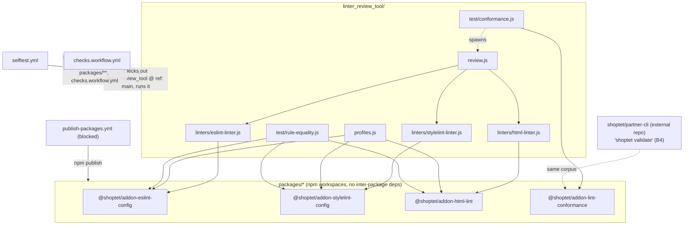

# Repository overview

Factual snapshot of this repository's structure and how its pieces reference each other.
Generated from the actual code (`package.json` dependency fields, `require()` calls, workflow
files) — see `CLAUDE.md` at the repo root for the authoritative, maintained description; this
file is a quick-orientation companion to it, not a replacement.

## Top-level layout

| Path | What it is |
| --- | --- |
| `linter_review_tool/` | The deterministic linter behind the PR gate. Entry point `review.js`, dispatches to `linters/{eslint,stylelint,html}-linter.js`. |
| `packages/` | Four npm workspaces (`addon-repository-actions-config`'s `workspaces: ["packages/*"]` in the root `package.json`) shared with the external `shoptet/partner-cli` repo. |
| `shoptet-addon-review/` | A separate Claude Code plugin (`shoptet-addon-review`, skill `st-addon-review`) — AI/heuristic PR review, independent of `linter_review_tool`. |
| `.github/workflows/` | `checks.workflow.yml` (PR gate + merge audit), `default.workflow.yml`/`deploy.workflow.yml` (build pipeline), `ci.yml` (actionlint + repo-level shell tests), `selftest.yml` (linter's own `yarn test`), `publish-packages.yml` (npm publish of `packages/*`, currently blocked — see below). |
| `tests/` | Repo-level tests that extract and exercise the embedded shell/`github-script` blocks straight out of the workflow YAML files. |
| `doc/plans/` | Forward-looking initiative plans (e.g. `rule-unification/`), never edited to describe what has already shipped. |

## The four `packages/*` workspaces

```
packages/addon-eslint-config/      @shoptet/addon-eslint-config
packages/addon-stylelint-config/   @shoptet/addon-stylelint-config
packages/addon-html-lint/          @shoptet/addon-html-lint
packages/addon-lint-conformance/   @shoptet/addon-lint-conformance
```

Checked directly in each package's `package.json` `dependencies`/`peerDependencies`: **none of
the four packages depends on any of the other three.** They are independent siblings. Their only
external (non-devDependency) dependencies are third-party: `@eslint-community/eslint-utils`,
`espree`, `globals` (peer: `eslint`) for `addon-eslint-config`; `parse5` for `addon-html-lint`;
peer `stylelint` for `addon-stylelint-config`; none for `addon-lint-conformance`.

All four are consumed by `linter_review_tool` via `link:../packages/...` entries in
`linter_review_tool/package.json`. Grepping `linter_review_tool` for `require('@shoptet/...')`
gives the exact per-file wiring:

| File | Imports |
| --- | --- |
| `linters/eslint-linter.js` | `@shoptet/addon-eslint-config` (`configs`, `parsesAsScript`) |
| `linters/stylelint-linter.js` | `@shoptet/addon-stylelint-config` (`configs`) |
| `linters/html-linter.js` | `@shoptet/addon-html-lint` (`lintHtmlSource`) |
| `profiles.js` | all three rule packages' `RELIABLE_RULES` export |
| `test/rule-equality.js` | all three rule packages' `RELIABLE_RULES` (asserts this repo's effective rule set equals each package's own declared set) |
| `test/conformance.js` | `@shoptet/addon-lint-conformance` (`corpus`, `materializeShape`) — runs `review.js` against materialized shapes and asserts file-discovery parity |

`@shoptet/addon-lint-conformance`'s own `README.md` additionally names the external consumer:
`shoptet/partner-cli`'s `shoptet validate` (its `B4` slice) runs the *same* corpus against its own
file-discovery code, to prove both runners agree without either owning a private copy of the test
data.

Per each package's `package.json`, all four are pinned to a git SHA by both consuming repos "the
same way ... until npm publish rights land" — `publish-packages.yml`'s own header states this is
currently **blocked**: npm publish rights in the `@shoptet` scope are held by other maintainers
and no trusted-publisher (OIDC) config exists yet, so the workflow is wired but every `npm
publish` step fails by design until that lands.

## Dependency graph



## Workflow relationships (facts from `.github/workflows/`)

- **`checks.workflow.yml`** — PR-time gate. Checks out `linter_review_tool/` at a hardcoded
  `ref: main` (confirmed in `CLAUDE.md`), so a rule change on a feature branch only takes effect
  for callers once merged to `main`. Posts inline review comments, gates on ❌ blockers, runs a
  post-merge `merge-audit` job.
- **`default.workflow.yml`** / **`deploy.workflow.yml`** — build & artifact pipeline for partner
  repos; `deploy.workflow.yml` is a thin wrapper whose `workflow_call.inputs` are kept identical to
  `default.workflow.yml`'s (enforced by `tests/test-workflow-scripts.sh`).
- **`ci.yml`** — runs on `push` to `main` and on `pull_request`; runs `actionlint` plus both
  `tests/test-*.sh` scripts (confirmed by reading the file's `on:` block).
- **`selftest.yml`** — runs the linter's own `yarn test` (selftest + rule-equality + conformance)
  whenever `linter_review_tool/**`, `packages/**`, or `checks.workflow.yml` changes.
- **`publish-packages.yml`** — publishes all four `packages/*` to npm via OIDC trusted publishing;
  its own header states this is currently blocked pending registry-side config, and is
  deliberately not wired to `push`/`pull_request` (only ships on a dedicated trigger, per the
  file's comments).

## `shoptet-addon-review/`

Confirmed by directory contents (`.claude-plugin/`, `skills/`, `CONTEXT.md`, `INSTALL.md`): this
is a self-contained Claude Code plugin, structurally separate from `linter_review_tool/` and
`packages/*` — no `require()`/dependency link from either into this directory was found. Per
`CONTEXT.md`, it is an AI/heuristic PR reviewer working against a separate FE rules catalog,
complementary to (not built on top of) the deterministic linter.
